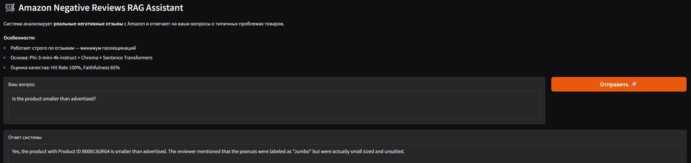
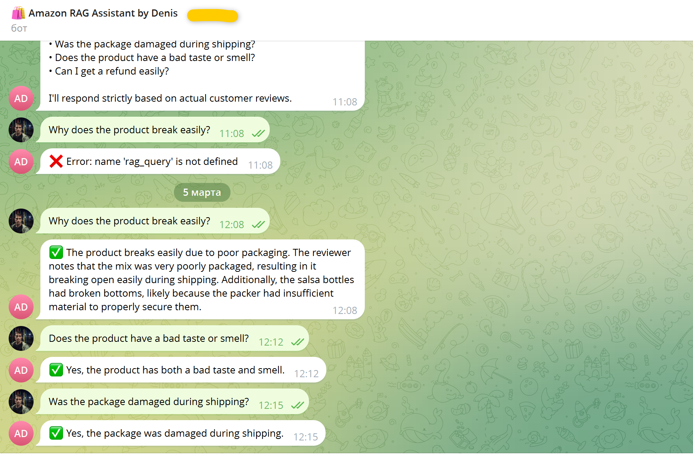

# 🛒 Amazon Negative Reviews RAG Assistant

## Обзор проекта

Проект представляет собой систему **Retrieval-Augmented Generation (RAG)** для анализа негативных отзывов о товарах Amazon (рейтинг 1–2 звезды).

Система выполняет:
- Семантический поиск по жалобам пользователей
- Генерацию обоснованных ответов на основе найденного контекста
- Ограничение галлюцинаций за счёт guardrails

---

## 🎯 Бизнес-задача

В e-commerce анализ негативных отзывов необходим для:

- Выявления повторяющихся дефектов продукции
- Анализа несоответствия ожиданий клиентов
- Автоматизации ответов на жалобы
- Сокращения времени ручной обработки отзывов

Система сфокусирована исключительно на негативных отзывах, чтобы специализироваться на диагностике проблем.

---

## 🏗 Архитектура решения

### 1. Подготовка данных
- Загрузка датасета Amazon: [Kaggle Dataset](https://www.kaggle.com/datasets/arhamrumi/amazon-product-reviews)
- Фильтрация отзывов с рейтингом ≤ 2
- Очистка текста
- Разбиение на чанки

### 2. Векторизация
- Модель эмбеддингов: **BAAI/bge-m3**
- Хранение векторного индекса в **ChromaDB**

### 3. Retrieval
- Top-k семантический поиск
- Ранжирование по косинусной близости

### 4. Генерация
- Модель: **Microsoft Phi-3-mini-4k-instruct (4-bit)**
- Генерация строго на основе retrieved-контекста

### 5. Guardrails
- Ограничение генерации рамками найденных документов
- Снижение риска галлюцинаций

---

## 🧪 Оценка качества

Тестирование проведено на 20 заранее подготовленных вопросах по 10 категориям жалоб.

| Метрика | Значение |
|---------|----------|
| **Hit Rate@2** | 100% |
| **Faithfulness** | ~65% |

---

## 🖥 Интерфейсы

- **Web-демо** на Gradio
- **Telegram-бот** (python-telegram-bot)

### 🖼 Demo

#### Gradio


#### Telegram
[](docs/demo/telegram_demo.mp4)

---

## 🛠 Стек технологий

- Python 3.12
- Hugging Face Transformers
- ChromaDB
- Sentence Transformers
- Gradio
- python-telegram-bot
- Docker (опционально)

---

## 🚀 Запуск

### Вариант 1: Локально

```bash
# 1. Клонировать репозиторий
git clone https://github.com/Dennis-rich/portfolio-projects.git
cd amazon-rag-bot

# 2. Установить зависимости
pip install -r requirements.txt

# 3. Запустить ноутбук
jupyter notebook notebooks/amazon_reviews_rag.ipynb


Telegram-бот: настройка

Получить токен в @BotFather

Запустить код и ввести токен при запросе
⚠️ Не коммитьте реальный токен в GitHub!

🧪 Тестовый режим

Для быстрой проверки можно проиндексировать только 100 чанков:

df = pd.read_csv(chunks_path).head(100)  # Тест
# df = pd.read_csv(chunks_path)  # Полный режим
📁 Структура проекта
amazon-rag-bot/
├── data/
│   ├── raw/              
│   ├── processed/        
│   └── vector_db/       
├── notebooks/
│   └── amazon_reviews_rag.ipynb  
├── reports/
│   ├── eda_plots/       
│   └── evaluation/       
├── models/
│   ├── embedding_model/  
│   └── llm_model/       
├── src/
│   └── __init__.py       
├── configs/              
├── docs/
│   └── demo/
│       ├── Amazon_Negative_Reviews.jpg
│       └── telegram_demo.mp4
├── images/
│   ├── gradio_demo.png
│   └── telegram_demo.png
├── .gitignore            
├── Dockerfile            
├── requirements.txt      
└── README.md             

👤 Автор
Denis | Data Scientist Intern
📍 Saratov, Russia