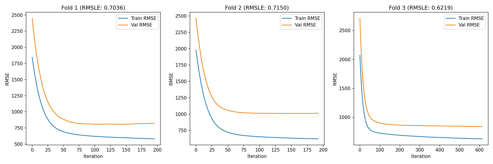
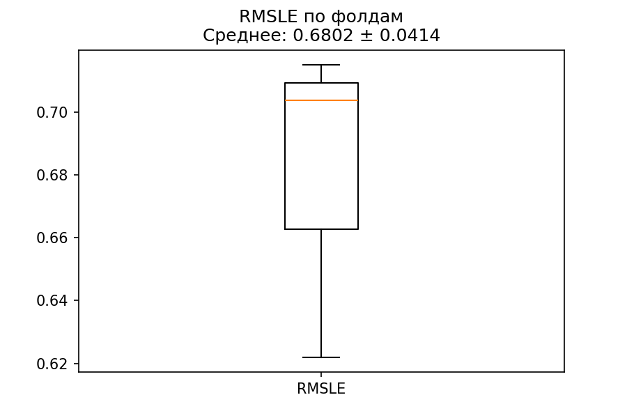
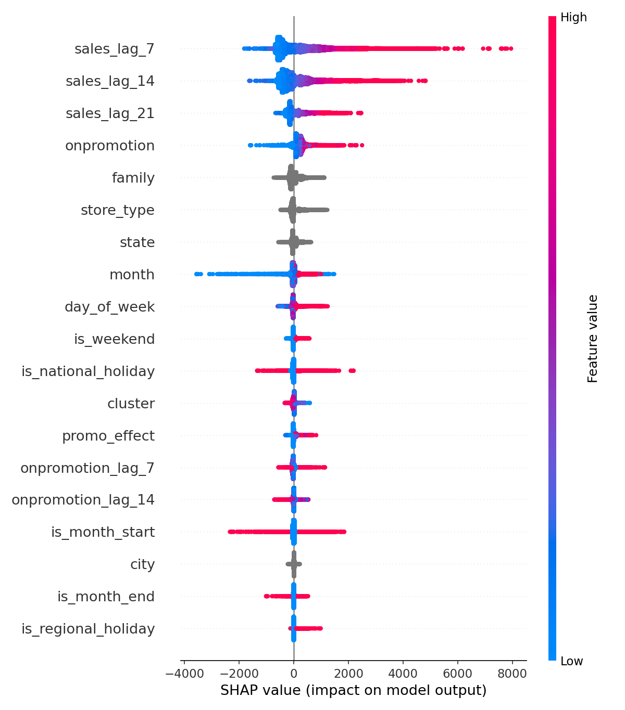
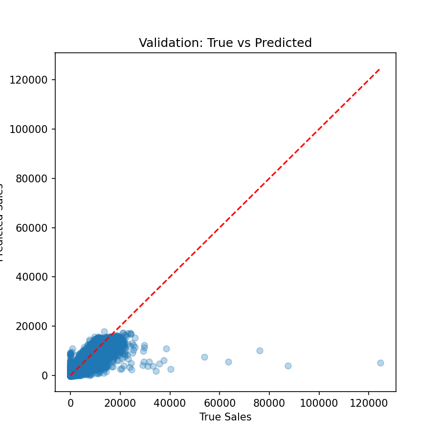

# 🛒 Store Sales Time Series Forecasting

> 🔗 [Оригинальное соревнование на Kaggle](https://www.kaggle.com/competitions/store-sales-time-series-forecasting)  
> 📌 **Цель**: предсказать дневные продажи товаров в сети супермаркетов Corporación Favorita (Эквадор) с использованием ML.  
> 📏 **Метрика**: RMSLE (Root Mean Squared Logarithmic Error)

---

## 📚 Структура проекта

- [`01_eda_store_sales_forecasting.ipynb`](notebooks/01_eda_store_sales_forecasting.ipynb) — исследовательский анализ данных  
- [`02_modeling_store_sales_forecasting.ipynb`](notebooks/02_modeling_store_sales_forecasting.ipynb) — моделирование и инференс-готовность  
- [`models/`](models/) — сохранённая модель и метаданные  
- [`plots/`](plots/) — ключевые визуализации  
- [`reports/`](reports/) — метрики, важность признаков, результаты Optuna  

---

## 🔍 1. Предмодельный анализ: от данных к стратегии

### 🧹 Подготовка и объединение
- Удалена колонка `id`, разрешены конфликты имён (`type` → `store_type`).
- Устранено **69 дубликатов** в данных о праздниках.
- Пропуски в праздничных полях — **не ошибка**, а отражение отсутствия праздников (85% дней).
- Итог: **1 782 040 строк**, период **2013–2017**, без дубликатов.

### 📈 Качество данных и распределение
- **Нет «холодного старта»**: все 1782 временных ряда (`магазин × категория`) непрерывны.
- **Продажи сильно скошены вправо** → обосновано использование **RMSLE** и `log1p`-трансформации.

### 🗓️ Выявленные паттерны
| Фактор | Эффект |
|-------|--------|
| **Неделя** | Пик — выходные (**+60%** к четвергу) |
| **Месяц** | Декабрь — максимум (**+30%** к среднему) |
| **Праздники** | Национальные: **+17%**, региональные: **+13%**, локальные: **+1%** |
| **День месяца** | Пики — 1-го и 25–31 числа (**+15–20%**) |

Эти паттерны легли в основу генерации признаков: `is_weekend`, `is_month_end`, `is_national_holiday` и др.

### 📦 Прерывистый спрос
- Категории `BOOKS` (97% нулей), `BABY CARE` (94%) — **не подходят для регрессии**.
- Решение: **двухступенчатый пайплайн** (классификация → регрессия) для B/C-категорий.

### 🎯 ABC-анализ
- **5 A-категорий** (`GROCERY I`, `BEVERAGES`, `PRODUCE`, `CLEANING`, `DAIRY`) — **79% продаж**.
- **31 A-магазин** — **80% выручки**.
- Промоакции: A-категории — **11.7%**, C-категории — **0.3%**.

### 🔬 Кластеризация A-рядов
Выявлено **4 типа спроса**:
- **Кластер 0**: низкий, стабильный → чувствителен к промо (**+96%**)
- **Кластер 1**: флагманский → слабая реакция на промо (**+6.5%**)
- **Кластер 2**: сезонный → высокая чувствительность (**+110%**)
- **Кластер 3**: смешанный → умеренный отклик (**+21%**)

> Это позволило адаптировать фича-инженеринг под типы поведения.

---

## 🧠 2. Моделирование и результаты

### 🔧 Подход
- **Данные**: только A-категории (фокус на бизнес-влияние).
- **Разбиение**: обучение до **2017-06-30**, тест — **2017-07-01 → 2017-08-15** (без утечки).
- **Фичи**: лаги продаж (7/14/21), лаги промо, дата-признаки, праздники, `promo_effect`.
- **Модель**: `CatBoostRegressor`.
- **Оптимизация**: `Optuna` (40 trials), Walk-Forward CV (3 фолда), минимизация RMSLE.

### 📊 Результаты
| Этап | RMSLE | Комментарий |
|------|-------|-------------|
| Walk-Forward CV (среднее) | **0.680 ± 0.041** | Включает нули (~12%) |
| Тест (финальная оценка) | **0.236** | Нет нулей, все продажи ≥ 93 |

✅ **RMSLE = 0.236** — сильный результат для задачи прогнозирования спроса.

### 🔍 Интерпретируемость
- **Топ-3 фичи**: `sales_lag_7` (34%), `sales_lag_14` (24%), `sales_lag_21` (9%).
- **Промо и праздники**: слабое влияние (< 5% суммарно).
- **SHAP**: модель «помнит прошлое», но **плохо адаптируется к пикам**.

> 💡 **Почему RMSLE на тесте ниже?**  
> В обучающей выборке — много нулей → большие ошибки в лог-шкале.  
> В тесте — только положительные продажи → ошибки малы.  
> **Это не утечка — особенность данных.**

### 🛠 Рекомендации по улучшению
- Взвешенное обучение на пиках спроса.
- Относительные лаги (`lag_7 / lag_14`).
- Альтернативные loss-функции (Poisson).

---

## 🎨 Визуализации

- **Кривые обучения**: 
- **Распределение RMSLE**: 
- **SHAP Summary**: 
- **Истинные vs Предсказанные**: 

---

## 🚀 Inference — готовность к деплою

Проект **полностью готов к использованию в реальном времени**:

- **Модель**: [`models/catboost_A_final.cbm`](models/catboost_A_final.cbm)
- **Метаданные**: [`models/model_features.json`](models/model_features.json) — фичи и категориальные признаки
- **CLI-инференс**: `predict.py`
- **Веб-демо**: `app.py` (Streamlit)

### Как запустить

1. Установите зависимости:
```bash
pip install -r requirements.txt